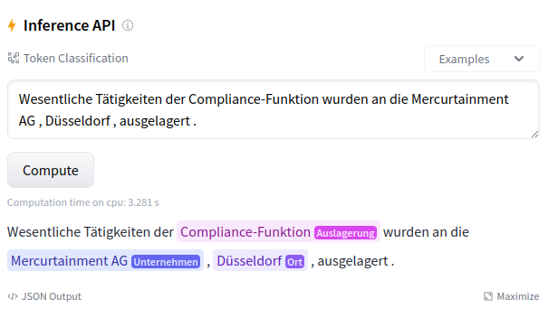

# CO-Funer

This repository shows how to fine-tune Flair models on the [CO-Fun](https://arxiv.org/abs/2403.15322) NER dataset.

## Dataset

The [Company Outsourcing in Fund Prospectuses (CO-Fun) dataset](https://arxiv.org/abs/2403.15322) consists of
948 sentences with 5,969 named entity annotations, including 2,340 Outsourced Services, 2,024 Companies, 1,594 Locations
and 11 Software annotations.

Overall, the following named entities are annotated:

* `Auslagerung` (engl. outsourcing)
* `Unternehmen` (engl. company)
* `Ort` (engl. location)
* `Software`

The CO-Fun NER dataset from the [Model Hub](https://huggingface.co/datasets/stefan-it/co-funer) is used for fine-tuning
Flair models.

## Fine-Tuning

The main fine-tuning is done in [`experiment.py`](experiment.py).

Fine-tuning can be started by calling the `run_experiment()` method and passing a so called `ExperimentConfiguration`.
In `ExperimentConfiguration` all necessary hyper-parameters and fine-tuning options are stored. The interface looks
like:

```python
class ExperimentConfiguration:
    batch_size: int
    learning_rate: float
    epoch: int
    context_size: int
    seed: int
    base_model: str
    base_model_short: str
    layers: str = "-1"
    subtoken_pooling: str = "first"
    use_crf: bool = False
    use_tensorboard: bool = True
```

A hyper-parameter search grid is defined in [`script.py`](script.py). This file is used to start the fine-tuning process.
Additionally, the script upload the Flair model to the Model Hub. The following environment variables should be set:

| Environment Variable | Description                                                                                              |
| -------------------- | -------------------------------------------------------------------------------------------------------- |
| `CONFIG`             | Should point to a configuration file in the `configs` folder, e.g. `configs/german_dbmdz_bert_base.json` |
| `HF_TOKEN`           | HF Access Token, which can be found [here](https://huggingface.co/settings/tokens)                       |
| `HUB_ORG_NAME`       | Should point to user-name or organization where the model should be uploaded to                          |
| `HF_UPLOAD`          | If this variable is set, fine-tuned Flair model won't be uploaded to the Model Hub                       |


## Hyper-Parameter Search

In this example the following hyper-parameter search grid is used:

* Batch Sizes = `[8, 16]`
* Learning Rates = `[3e-05, 5e-05]`
* Seeds = `[1, 2, 3, 4, 5]`

This means 20 models will be fine-tuned in total (2 x 2 x 5 = 20).

## Model Upload

After each model is fine-tuned, it will automatically be uploaded to the Hugging Model Hub. The following files are uploaded:

* `pytorch-model.bin`: Flair internally tracks the best model as `best-model.pt` over all epochs. To be compatible with the Model Hub the `best-model.pt`, is renamed automatically to `pytorch_model.bin`
* `training.log`: Flair stores the training log in `training.log`. This file is later needed to parse the best F1-score on development set
* `./runs`: In this folder the TensorBoard logs are stored. This enables a nice display of metrics on the Model Hub

## Model Card

Additionally, this repository shows how to automatically generate model cards for all uploaded models. This includes
also a results overview table with linked models.

The [`Example.ipynb`](Example.ipynb) notebook gives a detailed overview of all necessary steps.

## Results

We perform experiment for three BERT-based German language models:

* [German BERT](https://huggingface.co/google-bert/bert-base-german-cased)
* [German DBMDZ BERT](https://huggingface.co/dbmdz/bert-base-german-cased)
* [GBERT](https://huggingface.co/deepset/gbert-base)

The following overview table shows the best configuration (batch size, learning rate) for each model on the development
dataset:

| Model Name        | Configuration      | Seed 1       | Seed 2       | Seed 3       | Seed 4       | Seed 5          | Average             |
| ----------------- |--------------------|--------------|--------------|--------------|--------------|-----------------|---------------------|
| German BERT       | `bs8-e10-lr5e-05`  | [0.9346][1]  | [0.9388][2]  | [0.9301][3]  | [0.9291][4]  | [0.9346][5]     | 0.9334 ± 0.0039     |
| German DBMDZ BERT | `bs8-e10-lr5e-05`  | [0.9378][11] | [0.928][12]  | [0.9383][13] | [0.9374][14] | [0.9364][15]    | 0.9356 ± 0.0043     |
| GBERT             | `bs8-e10-lr5e-05`  | [0.9477][21] | [0.935][22]  | [0.9517][23] | [0.9443][24] | [0.9342][25]    | **0.9426** ± 0.0077 |

It can be seen, that GBERT has strongest performance and achieves an average F1-Score of 94.26% on the development set.

Now, we retrieve the F1-Score for the best configuration of each model on the test set:


| Model Name        | Configuration      | Seed 1       | Seed 2       | Seed 3       | Seed 4       | Seed 5          | Average             |
| ----------------- |--------------------|--------------|--------------|--------------|--------------|-----------------|---------------------|
| German BERT       | `bs8-e10-lr5e-05`  | [0.9141][1]  | [0.9159][2]  | [0.9121][3]  | [0.9062][4]  | [0.9105][5]     | 0.9118 ± 0.0033     |
| German DBMDZ BERT | `bs8-e10-lr5e-05`  | [0.9134][11] | [0.9076][12] | [0.9070][13] | [0.8821][14] | [0.9091][15]    | 0.9038 ± 0.0111     |
| GBERT             | `bs8-e10-lr5e-05`  | [0.9180][21] | [0.9117][22] | [0.9163][23] | [0.9155][24] | [0.9110][25]    | 0.9145 ± 0.0027     |

The GBERT model has strongest performance again. With 91.45% our result is close to the reported 92.2% (see Table 1 in
the CO-Fun paper).

[1]: https://hf.co/stefan-it/flair-co-funer-german_bert_base-bs8-e10-lr5e-05-1
[2]: https://hf.co/stefan-it/flair-co-funer-german_bert_base-bs8-e10-lr5e-05-2
[3]: https://hf.co/stefan-it/flair-co-funer-german_bert_base-bs8-e10-lr5e-05-3
[4]: https://hf.co/stefan-it/flair-co-funer-german_bert_base-bs8-e10-lr5e-05-4
[5]: https://hf.co/stefan-it/flair-co-funer-german_bert_base-bs8-e10-lr5e-05-5
[11]: https://hf.co/stefan-it/flair-co-funer-german_dbmdz_bert_base-bs8-e10-lr5e-05-1
[12]: https://hf.co/stefan-it/flair-co-funer-german_dbmdz_bert_base-bs8-e10-lr5e-05-2
[13]: https://hf.co/stefan-it/flair-co-funer-german_dbmdz_bert_base-bs8-e10-lr5e-05-3
[14]: https://hf.co/stefan-it/flair-co-funer-german_dbmdz_bert_base-bs8-e10-lr5e-05-4
[15]: https://hf.co/stefan-it/flair-co-funer-german_dbmdz_bert_base-bs8-e10-lr5e-05-5
[21]: https://hf.co/stefan-it/flair-co-funer-gbert_base-bs8-e10-lr5e-05-1
[22]: https://hf.co/stefan-it/flair-co-funer-gbert_base-bs8-e10-lr5e-05-2
[23]: https://hf.co/stefan-it/flair-co-funer-gbert_base-bs8-e10-lr5e-05-3
[24]: https://hf.co/stefan-it/flair-co-funer-gbert_base-bs8-e10-lr5e-05-4
[25]: https://hf.co/stefan-it/flair-co-funer-gbert_base-bs8-e10-lr5e-05-5

## Release of Fine-tuned Models

All fine-tuned models for this repository are available on the Hugging Face Model Hub incl. a working inference widget
that allows to perform NER:



All fine-tuned models can be found [here](https://huggingface.co/models?search=flair-co-funer). The best models can be
found in
[this collection](https://huggingface.co/collections/stefan-it/fine-tuned-co-funer-models-66058539530368090082214f).

# Changelog

* 28.03.2024: Initial version of this repository.
